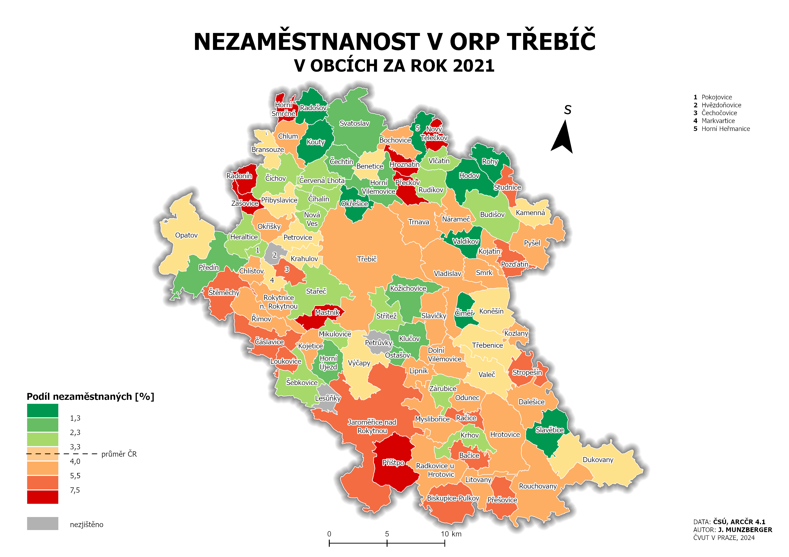
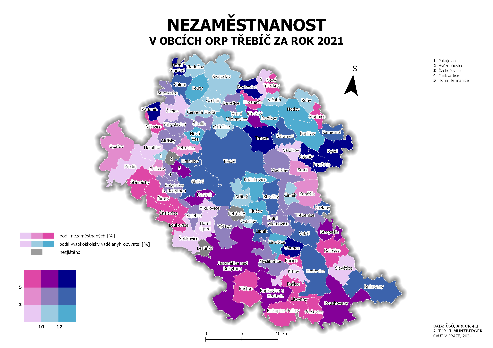
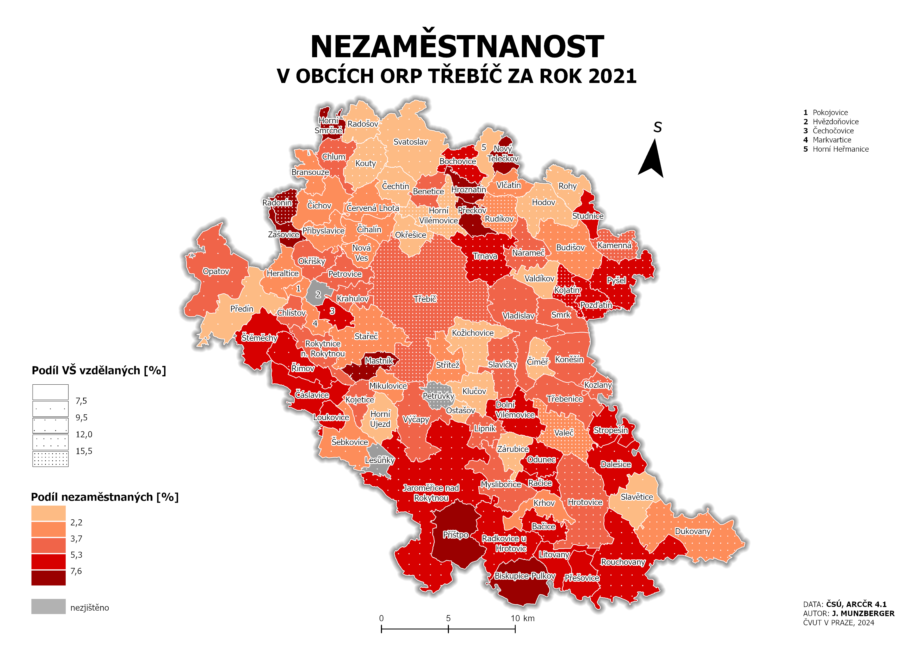

# Úloha 3 – Metody tematické kartografie: kartogram, kartodiagram

## Zadání

V první části cvičení si vyzkoušíme dvě formy znázornění jednoduchého nepravého kartogramu (pseudokartogramu) – homogenní (Mapa 1) a kvalifikační/klasifikační (Mapa 2). V další části navážeme tvorbou složeného pseudokartogramu (Mapa 3 a Mapa 4), u něhož si představíme opět dvě formy znázornění (barva+barva vs. barva+rastr). Na závěr si ukážeme tvorbu složeného kartodiagramu (Mapa 5).

**S využitím software ArcGIS Pro vytvořte následující autorské koncepty tematické mapy na formát velikosti A3.**

**Mapa 1** bude s využitím jednoduchého homogenního pseudokartogramu zobrazovat **míru nezaměstnanosti** v obcích ORP (dle individuálního zadání, viz níže)

<figure markdown>
  { width=500px }
  <figcaption>Mapa 1</figcaption>
</figure>

**Mapa 2** bude s využitím jednoduchého klasifikačního pseudokartogramu zobrazovat **míru nezaměstnanosti** v obcích ORP (dle individuálního zadání, viz níže)

<figure markdown>
  { width=500px }
  <figcaption>Mapa 2</figcaption>
</figure>

**Mapa 3** bude s využitím složeného pseudokartogramu (barva+barva) zobrazovat **míru nezaměstnanosti a podíl obyvatel s VŠ vzděláním** v obcích ORP (dle individuálního zadání, viz níže)

<figure markdown>
  { width=500px }
  <figcaption>Mapa 3</figcaption>
</figure>

**Mapa 4** bude s využitím složeného pseudokartogramu (barva+rastr) zobrazovat **míru nezaměstnanosti a podíl obyvatel s VŠ vzděláním** v obcích ORP (dle individuálního zadání, viz níže)

<figure markdown>
  { width=500px }
  <figcaption>Mapa 4</figcaption>
</figure>

<!-- 5.  **Mapa 5** bude s využitím jednoduchého homogenního pseudokartogramu a strukturního kartodiagramu zobrazovat index stáří a složení obyvatelstva dle věku v obcích ORP (dle individuálního zadání, viz níže)

<figure markdown>
  .png "Mapa 5"){ width=300px }
  <figcaption>Mapa 5</figcaption>
</figure> -->

**Mapa 5** bude s využitím jednoduchého homogenního pseudokartogramu a složeného součtového kartodiagramu zobrazovat **index stáří, složení obyvatelstva dle věku a počet obyvatel** v obcích ORP (dle individuálního zadání, viz níže)

<figure markdown>
  .png "Mapa 5"){ width=300px }
  <figcaption>Mapa 5</figcaption>
</figure>

## Postup

**Jednotlivá zadání**

-   viz [**tabulka**](https://docs.google.com/spreadsheets/d/1x8FFegspPplLoEs1yxckCR0jmcm-UUKcbpNQnq7WeVA/edit?gid=1292987354#gid=1292987354){target="_blank"}

**Zdroje dat**

-   polygonová vrstva obcí a ORP z ArcČR 4.3 (dostupné na Shares\\K155\\Public\\data\\ArcGIS)

**Postup zpracování**

-   [jednoduchý kartogram](https://k155cvut.github.io/kar2/kartogram/){target="_blank"} (Mapa 1–4)
-   [kartodiagram](https://k155cvut.github.io/kar2/kartodiagram/){target="_blank"} (Mapa 5)

## Výstupy cvičení
Povinným výstupem úlohy je __technická zpráva v elektronické podobě__ odevzdaná v termínu prostřednictvím systému [__Moodle__](https://moodle-vyuka.cvut.cz/mod/assign/view.php?id=399426){.color_def .underlined_dotted .external_link_icon target="_blank"}.

???+ note-grey "Požadované náležitosti technické zprávy"
    -   **vybrané statistiky o území** *(počet obcí, statistické ukazatele pro každý jev (průměr, medián, minimum, maximum) + název obce s danou hodnotou jevu)*,
    -   **srovnání klasifikačních metod (min. 4)** *(Která metoda je dle Vás vhodnější a proč? Uveďte jejich výhody/nevýhody. Přiložte printscreen histogramu a vizualizace dat.)*,
    -   **srovnání použitých forem jednoduchého kartogramu:**
    
        - ***homogenní vs. klasifikační*** *(Který způsob je dle Vás vhodnější a proč? Uveďte jeho výhody/nevýhody.)*,
    -   **srovnání různých forem rastrových stupnic ve složeném kartogramu (min. 3):**
    
        - ***jednoduchý liniový vs. jednoduchý tečkový vs. jednoduchý + složeného liniový rastr*** *(Který způsob je dle Vás vhodnější a proč? Uveďte jejich výhody/nevýhody. Přiložte printscreen všech 3 způsobů. Z prezentovaných způsobů jednoduchého liniového/tečkového rastru zvolte vždy pouze jeden, tj. buď s proměnným rozestupem linií/teček, nebo s proměnnou velikostí/tloušťkou symbolu.)*,
    -   **srovnání použitých forem složeného kartogramu:** 
    
    
        - ***barva+rastr vs. barva+barva*** *(Který způsob je dle Vás vhodnější a proč? Uveďte jejich výhody/nevýhody. Který se lépe hodí pro kombinaci s kartodiagramem?)*,
    -   **povinnou přílohou jsou všechny vytvořené tematické mapy na formát A3** *(prosíme sloučit všechny mapy k TZ do jednoho PDF!)*;

## Hodnocení
Úloha je uznána (stav splněno/nesplněno), pokud jsou splněny následující podmínky:

-   úplnost technické zprávy (obsah TZ viz výše)
-   splnění zásad tematické kartografie (viz [**povinná kritéria**](https://docs.google.com/spreadsheets/d/1x8FFegspPplLoEs1yxckCR0jmcm-UUKcbpNQnq7WeVA/edit?gid=0#gid=0){target="_blank"})

!!! warning "Opravy"
    V případě, že odevzdaný výstup není správný, je vyučujícím prostřednictvím systému Moodle __vrácen k opravě__. Opravený výstup se odevzdává opět prostřednictvím systému [__Moodle__](https://moodle-vyuka.cvut.cz/mod/assign/view.php?id=399426){.color_def .underlined_dotted .external_link_icon target="_blank"} vždy nejpozději do 7 dní od vrácení úlohy. Výstup lze odevzdat po __maximálně dvou opravách__, v případě pozdního odevzdání či nesprávného výstupu po druhé opravě je úloha __označena jako nesplněná__{style="color:#c22521;"}.

## Termíny

- odevzdání 1: __neděle 30. listopadu 2025__{.outlined}
- odevzdání 2 (oprava 1): __středa 10. prosince 2025__{.outlined}
- odevzdání 3 (oprava 2): __pátek 19. prosince 2025__{.outlined}

