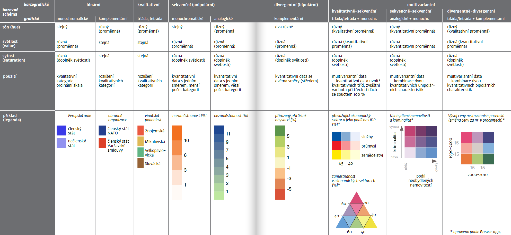
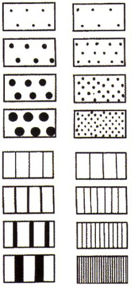
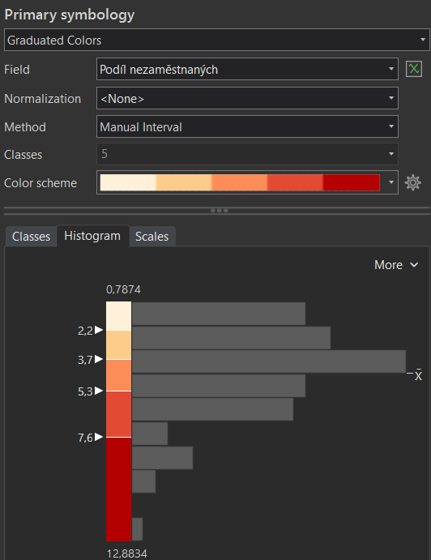

# Kartogram
Podstatou kartogramu (*choropleth map*) je znázornění jevu vyjádřeného *relativními* hodnotami, zachyceného za dílčí územní celky. Pro správné srovnání je klíčové, aby data byla *relativní*, tj. v ideálním případě přepočtená na plochu územní jednotky (tzv. pravý kartogram), akceptovatelné je i přepočítání s využitím jiné charakteristiky územní jednotky, např. na počet obyvatel (tzv. nepravý kartogram). Častou a zásadní chybou je použití této kartografické vyjadřovací metody na absolutní data. (Lysák, 2014)

### Základní dělení kartogramů
1.  *Jednoduchý kartogram* 
    1.  *Homogenní kartogram* zobrazuje pouze jeden relativní jev, a to změnou barvy nebo rastru
    2.  *Kvalifikační kartogram* znázorňuje rozdíl jevu od zvolené střední hodnoty S, pro oblasti s hodnotou jevu větší než S se volí odstíny barvy opačného charakteru než pro jevy s hodnotu menší než S.
2.  *Složený kartogram* zobrazuje hodnoty dvou nebo více jevů, umožňuje jejich vzájemné srovnání, typicky je jeden jev vyjádřen barvou, druhý rastrem

Tvorba kartogramu zahrnuje tři hlavní úkoly:

1.  Tvorba intervalové stupnice, resp. klasifikace vstupních dat do intervalů.
2.  Grafické řešení jejich znázornění v mapě (obvykle pomocí barevné stupnice či rastru).
3.  Návrh správné legendy.

### Grafický návrh znázornění intervalů v mapě

#### Barevné stupnice
Při výběru nebo tvorbě barevných stupnic pro tematické mapy jsou klíčová data, která mapa zobrazuje: barevné schéma by mělo odpovídat povaze dat. Barevná schémata v kartografii v základu rozdělujeme na binární, kvalitativní, sekvenční (unipolární) a divergentní (bipolární) viz schéma níže. Pro složitější data (s kombinací více proměnných) vytváříme složitější kombinovaná barevná schémata. (Miklín, 2017)

<figure markdown>
  { width=1000px }
  <figcaption>Barevné stupnice (Miklín, 2017)</figcaption>
</figure>

#### Rastrové stupnice
Nejběžnějším způsobem vyjádřením kvantity rastrem je šrafování, příp. tečkování. Intenzita se znázorňuje dvěma způsoby:

1.      zvyšováním hustoty čar (teček), přičemž tloušťka čar (velikost teček) zůstává stejná
2.      zvětšováním tloušťky čar (velikosti teček), přičemž hustota čar (teček) zůstává stejná

Nejřidší šrafování odopvídá nejnižší intenzitě jevu, nejhustší pak nejvyšší.

<figure markdown>
  { width=200px }
  <figcaption>Nejjednodušší řešení rastru pro kartogram (Kaňok, Voženílek, 2011)</figcaption>
</figure>

!!! note "Jednoduchý kartogram v ArcGIS Pro"

    **Rozdělení dat do intervalů**
    
    - zvolíme vhodnou metodu vizualizace pro kvantitativní data odpovídající definici kartogramu *--> Primary symbology-Graduated Colors*
    - zvolíme data, která chceme vizualizovat (*Field*) 
    - prozkoumáme statistické rozdělení dat prostřednictvím histogramu *(Symbology-Histogram)*
    - zvolíme vhodný klasifikační algoritmus  *(Method)* a počet intervalů *(Classes)*
    - v případě potřeby výslednou klasifikaci dodatečně manuálně upravíme (např. zaokrouhlení hraničních hodnot)

    <figure markdown>
     { width=300px }
    <figcaption>Kartogram - klasifikace dat v ArcGIS Pro</figcaption>
    </figure>

    **Vizualizace dat**
    
      - **barevná stupnice:** 
          - barvu lze postupně definovat pro jednotlivé intervaly *(Classes-Symbol)* či zvolit jednu z předdefinovaných barevných stupnic *(Color scheme)*, které je možné dodatečně formátovat *(Format color scheme)*, což se hodí například pro tvorbu divergentní barevné stupnice, která není v nabídce barevných stupnic defaultně dostupná
      
      <figure markdown>
     { width=400px }
    <figcaption>Barevné stupnice v  ArcGIS Pro</figcaption>
    </figure>
    
      - **rastrová stupnice:**
          - tvorba rastrové stupnice