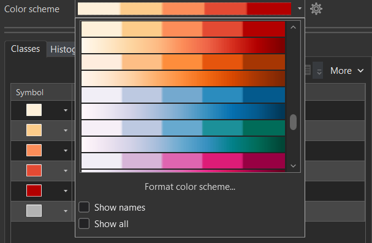
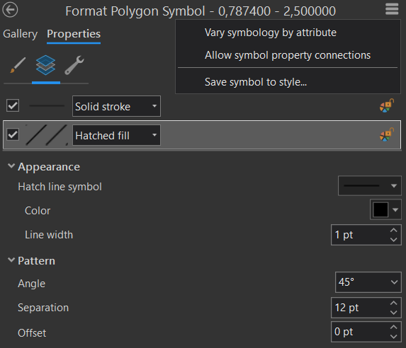

# Kartogram
Podstatou **kartogramu** (*choropleth map*) je znázornění jevu vyjádřeného **relativními hodnotami**, zachyceného za dílčí územní celky. Pro správné srovnání je klíčové, aby data byla **relativní**, tj. v ideálním případě přepočtená na plochu územní jednotky (tzv. **pravý kartogram**), akceptovatelné je i přepočítání s využitím jiné charakteristiky územní jednotky, např. na počet obyvatel (tzv. **nepravý kartogram**). Častou a zásadní chybou je použití této kartografické vyjadřovací metody na absolutní data. *(Lysák, 2014)*

**Další zdroje:**

[GISKA Kartogramy a pseudokartogramy](http://giska.cz/kartografie/kartogramy-a-pseudokartogramy/){ .md-button .md-button--primary .server_name .external_link_icon_small target="\_blank"}
[Jaroš a Lysák (2014) Kartogram](https://drive.google.com/file/d/16PnDgYr6c1LGUuMTF45a0hFPHyf7rrLm/view){ .md-button .md-button--primary .server_name .external_link_icon_small target="\_blank"}
[Pravda (2004) O aplikáciách kartogramovej metódy](https://www.sav.sk/journals/uploads/05131247Pravda.pdf){ .md-button .md-button--primary .server_name .external_link_icon_small target="\_blank"}
{: .button_array}

## Základní pojmy
### Základní dělení kartogramů
1.  ***Jednoduchý kartogram***
    1.  ***Homogenní kartogram*** zobrazuje pouze jeden relativní jev, a to změnou barvy nebo rastru
    <figure markdown>
    { width=500px }
    <figcaption>Jednoduchý homogenní pseudokartogram zobrazující míru nezaměstnanosti v obcích ORP</figcaption>
    </figure>
    2.  ***Klasifikační/kvalifikační kartogram*** znázorňuje rozdíl jevu od zvolené střední hodnoty S (např. průměr, medián, směrodatná odchylka, nula/, nulová změna, ...). Pro oblasti s hodnotou jevu větší než S se volí odstíny barvy opačného charakteru než pro jevy s hodnotu menší než S.
    <figure markdown>
    { width=500px }
    <figcaption>Jednoduchý klasifikační/kvalifikační pseudokartogram zobrazující míru nezaměstnanosti v obcích ORP</figcaption>
    </figure>
2.  ***Složený kartogram*** zobrazuje hodnoty dvou nebo více jevů, umožňuje jejich vzájemné srovnání, typicky je jeden jev vyjádřen barvou, druhý rastrem

    <figure markdown>
    { width=500px }
    <figcaption>Složený pseudokartogram zobrazující míru nezaměstnanosti a podíl obyvatel s VŠ vzděláním v obcích ORP s využitím kombinace dvou barevných stupnic</figcaption>
    </figure>

    <figure markdown>
    { width=500px }
    <figcaption>Složený pseudokartogram zobrazující míru nezaměstnanosti a podíl obyvatel s VŠ vzděláním v obcích ORP s využitím kombinace barevné a rastrové stupnice</figcaption>
    </figure>

### Obecný postup tvorby kartogramu

0.  Příprava dat *(např. přepočet absolutních dat na plochu územní jednotky či počet obyvatel)*
1.  Rozdělení vstupních dat do intervalů *(viz [Klasifikace dat](../klasifikace))*
2.  Vizualizace dat v mapě *(např. s využitím [barevné či rastrové stupnice](../kartogram/#graficka-podoba-stupnic))*
3.  Konstrukce legendy

### Grafická podoba stupnic

#### Barevné stupnice
Při výběru nebo tvorbě barevných stupnic pro tematické mapy jsou klíčová data, která mapa zobrazuje: barevné schéma by mělo odpovídat povaze dat. Barevná schémata v kartografii v základu rozdělujeme na binární, kvalitativní, sekvenční (unipolární) a divergentní (bipolární) viz schéma níže. Pro složitější data (s kombinací více proměnných) vytváříme složitější kombinovaná barevná schémata. (Miklín, 2017)

<figure markdown>
  { width=1000px }
  <figcaption>Barevné stupnice (Miklín, 2017)</figcaption>
</figure>

#### Rastrové stupnice
Nejběžnějším způsobem vyjádřením kvantity rastrem je šrafování, příp. tečkování. Intenzita se znázorňuje dvěma způsoby:

1.      zvyšováním hustoty čar (teček), přičemž tloušťka čar (velikost teček) zůstává stejná
2.      zvětšováním tloušťky čar (velikosti teček), přičemž hustota čar (teček) zůstává stejná

Nejřidší šrafování odpovídá nejnižší intenzitě jevu, nejhustší pak nejvyšší.

<figure markdown>
  { width=200px }
  <figcaption>Nejjednodušší řešení rastru pro kartogram (Kaňok, Voženílek, 2011)</figcaption>
</figure>

Pro vyjádření narůstající intenzity jevu lze využít také odlišný směr linií. Nejvyšší kategorie intenzity jevu se pak obvykle znázorňují pomocí složeného/vícesměrného rastru. Z důvodu jednotnosti rastru zachování kolmosti linií u složeného rastru je u šikmých linií vhodné použít sklon ± 45°.

<figure markdown>
  . Intenzita narůstá zleva doprava."){ width=800px }
  <figcaption>Doporučené pořadí směru linií pro vyjádření intenzity jevu dle Voženílka (2001). Intenzita narůstá zleva doprava.</figcaption>
</figure>

Názornost výše uvedeného způsobu pro uživatele mapy je však velmi diskutabilní. V praxi je proto vhodné změnu směru linií kombinovat se změnou jiného (pro uživatele mapy názornějšího) parametru linie, jako je např. rozestup linií či tloušťka linie.

<figure markdown>
  "){ width=800px }
  <figcaption>Příklad využití změny směru linií v kombinaci se změnou loušťky linií (Jaroš a Lysák, 2014)</figcaption>
</figure>

<figure markdown>
  "){ width=200px }
  <figcaption>Příklad využití změny směru linií v kombinaci se změnou rozestupu linií (Jaroš a Lysák, 2014)</figcaption>
</figure>

 

## Tvorba kartogramu v ArcGIS Pro
### Rozdělení dat do intervalů

!!! note "Jak na to?"
    **Homogenní kartogram**
    
    - zvolíme vhodnou metodu vizualizace pro kvantitativní data odpovídající definici jednoduchého kartogramu *(Primary symbology-Graduated Colors)*
    - zvolíme data, která chceme vizualizovat *(Field)* 
    - prozkoumáme statistické rozdělení dat prostřednictvím histogramu *(Symbology-Histogram)*
    - zvolíme vhodný klasifikační algoritmus *(Method)* a počet intervalů *(Classes)*
    - v případě potřeby výslednou klasifikaci dodatečně manuálně upravíme (např. zaokrouhlení hraničních hodnot)

    <figure markdown>
     { width=400px }
    <figcaption>Homogenní kartogram - klasifikace dat v ArcGIS Pro</figcaption>
    </figure>

    **Klasifikační/kvalifikační kartogram**

    - zvolíme vhodnou metodu vizualizace pro kvantitativní data odpovídající definici jednoduchého kartogramu *(Primary symbology-Graduated Colors)*
    - zvolíme data, která chceme vizualizovat *(Field)*
    - zjistíme střední hodnotu zobrazovaného jevu *(More-Show statistics)*, kterou můžeme zahrnout do samostatného intervalu (lichý počet intervalů) nebo ji využít jako mezní hodnotu oddělující intervaly nad/pod zvolenou hodnotou (sudý počet intervalů)
    - prozkoumáme statistické rozdělení dat prostřednictvím histogramu *(Symbology-Histogram)*
    - zvolíme vhodný klasifikační algoritmus *(Method)* a počet intervalů *(Classes)*
    - v případě potřeby výslednou klasifikaci dodatečně manuálně upravíme (např. zaokrouhlení hraničních hodnot)

    <figure markdown>
    { width=800px }
    <figcaption>Kvalifikační kartogram - klasifikace dat v ArcGIS Pro</figcaption>
    </figure>

    ???+ tip "Využití duplicitní vrstvy"
        Alternativním řešením tvorby klasifikační/kvalifikační kartogramu v ArcGIS Pro je vytvoření kopie původní datové vrstvy, která bude zobrazovat pouze data nad/pod zvolenou střední hodnotou. Původní datová vrstva bude zobrazovat hodnoty pod/nad zvolenou střední hodnotou. Pro každou datovou vrstvu je pak nutné nastavit vhodnou konvergentní barevnou stupnici, aby územní jednotky s hodnotou jevu větší než S byly zobrazeny odstíny barvy opačného charakteru než územní jednotky s hodnotou jevu menší než S *(např. odstíny zelené pro hodnoty nad S, resp. odstíny červené pro hodnoty pod S)*.

        <figure markdown>
         vs. řešení s využitím duplicitní vrstvy (vpravo)"){ width=600px align=center}
        <figcaption>Možnosti tvorby klasifikačního/kvalifikačního kartogramu v ArcGIS Pro. Ukázka řešení s využitím jedné vrstvy (vlevo) vs. řešení s využitím duplicitní vrstvy (vpravo)</figcaption>
        </figure>

    **Složený kartogram**
    
    - zvolíme vhodnou metodu vizualizace pro kvantitativní data odpovídající definici složeného kartogramu kombinující dvě barevné stupnice *(Primary symbology-Bivariate Colors)*
    - zvolíme data, která chceme vizualizovat *(Field 1, Field 2)* 
    - prozkoumáme statistické rozdělení dat prostřednictvím histogramu *(Symbology-Histogram)*
    - zvolíme vhodný klasifikační algoritmus *(Method)* a počet intervalů *(Grid Size)*
    - v případě potřeby výslednou klasifikaci dodatečně manuálně upravíme (např. zaokrouhlení hraničních hodnot)

    <figure markdown>
     { width=400px }
    <figcaption>Složený kartogram - klasifikace dat v ArcGIS Pro</figcaption>
    </figure>    

### Vizualizace dat
!!! note "Jak na to?"
    
    **Barevná stupnice**

    **1. jednoduchý kartogram**

      - barvu můžeme postupně definovat pro jednotlivé intervaly *(Classes-Symbol)* či si zvolit jednu z předdefinovaných barevných stupnic *(Color scheme)*, které je možné dodatečně formátovat *(Format color scheme)*, což se hodí například pro tvorbu divergentní barevné stupnice, která není v nabídce barevných stupnic defaultně dostupná
      - pro návrh barevných stupnic je vhodné využít nástroj [*ColorBrewer*](https://colorbrewer2.org/){target=" blank"}
      
    <figure markdown>
    { width=400px }
    <figcaption>Barevná stupnice pro jednoduchý kartogram v ArcGIS Pro</figcaption>
    </figure>

    **2. složený kartogram (barva+barva)**

      - lze zvolit jednu z předdefinovaných barevných stupnic *(Color scheme)*, které je možné dodatečně formátovat *(Format color scheme)*
      - pro návrh barevných stupnic je vhodné využít nástroj [*Bivariate Choropleth Color Generator*](https://observablehq.com/@angiehjort/bivariate-color-generator){target=" blank"}
      
    <figure markdown>
    { width=200px }
    <figcaption>Barevná stupnice pro složený kartogram kombinující dvě barevné stupnice</figcaption>
    </figure>    
    
    **Rastrová stupnice**

    - rastr musíme definovat manuálně pro jednotlivé intervaly *(Classes-Symbol)* (sw neumí automaticky generovat rastrové stupnice)
    - ve vlastnostech symbolu *(Properties-Layers)* je nutné změnit typ výplně na *Hatched fill* a vhodně nastavit vybrané parametry rastru, jako např. barvu linie *(Color)*, tloušťku linie *(Line width)*, sklon *(Angle)*, rozestup *(Separation)*
          
    <figure markdown>
    { width=400px }
    <figcaption>Nastavení rastrové výplně ve vlastnostech symbolu</figcaption>
    </figure>

    ???+ tip "Uložení vlastního symbolu"
        - pro usnadnění práce je vhodné symbol se základním nastavením uložit do stylu *(horní menu-Save symbol to style)* a následně jej aplikovat pro všechny ostatní intervaly (v *Symbology-Classes* zvolte *More-Format all symbols*, poté příslušný symbol vyberte z galerie symbolů *(Gallery)*)
        - u dalších intervalů již postačí nastavit jen vhodnou hodnotu tloušťku linii *(Line width)* či jejich rozestupu *(Separation)* tak, aby s narůstající intenzitou jevu narůstala hustota rastru (v závislosti na zvoleném způsobu vykreslení rastru)
    ???+ tip "Vícesměrný rastr"    
        - narůstající hustotu můžeme vyjádřit i s využitím vícesměrného rastru (dva na sebe kolmé jednosměrné rastry)
        - ve vlastnostech symbolu *(Properties-Structure)* duplikujeme vrstvu výplně symbolu, pro kterou v části *(Properties-Layers)* nastavíme hodnotu rozestupu *(Separation)* tak, aby na sebe oba jednosměrně rastry byly kolmé (nejčastěji volíme sklonitost 45° a 135°)
        <figure markdown>
        { width=150px }
        <figcaption>Přidání vrstvy symbolu</figcaption>
        </figure>

<!--
### Konstrukce legendy
!!! note "Jak na to?"
    **Homogenní kartogram**
    
    - TBA

    <figure markdown>
     { width=400px }
    <figcaption>Homogenní kartogram - klasifikace dat v ArcGIS Pro</figcaption>
    </figure>

    **Klasifikační/kvalifikační kartogram**

    - TBA

    <figure markdown>
    { width=800px }
    <figcaption>Kvalifikační kartogram - klasifikace dat v ArcGIS Pro</figcaption>
    </figure>

    **Složený kartogram (barva+barva)**
    
    - TBA

    <figure markdown>
     { width=400px }
    <figcaption>Složený kartogram - klasifikace dat v ArcGIS Pro</figcaption>
    </figure>    
-->
## Použité zdroje

- Bláha, J, D.: Vybrané okruhy z geografické kartografie. Ústí nad Labem: UJEP, 2017. ISBN: 978-80-7561-092-8.
- Jaroš, J., Lysák, J.: Kartogram. In: Moderní geoinformační metody ve výuce GIS, 2014. Dostupné z: [https://drive.google.com/file/d/16PnDgYr6c1LGUuMTF45a0hFPHyf7rrLm/view](https://drive.google.com/file/d/16PnDgYr6c1LGUuMTF45a0hFPHyf7rrLm/view)
- Miklín, J., R. Dušek, L. Krtička a O. Kaláb: Tvorba map. Ostrava: Ostravská univerzita, 2018. ISBN: 978-80-7599-017-4. Dostupné z: [https://tvorbamap.osu.cz/ke-stazeni/](https://tvorbamap.osu.cz/ke-stazeni/)
- Voženílek V.: Aplikovaná kartografie I.: tematické mapy, 2. vydání. Olomouc: Univerzita Palackého, 2001. ISBN: 80-244-0270-X.
- Voženílek, V. a kol.: Metody tematické kartografie – vizualizace prostorových jevů. Olomouc: Univerzita Palackého, 2011. ISBN: 978-80-244-2790-4.
- GISKA – GIS a kartografie…: Kartografie [online]. Dostupné z: [http://giska.cz/kartografie/](http://giska.cz/kartografie/) [cit. 14. 11. 2025].