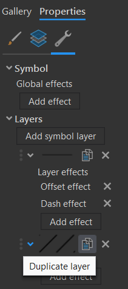

# Kartogram
Podstatou kartogramu (*choropleth map*) je znázornění jevu vyjádřeného *relativními* hodnotami, zachyceného za dílčí územní celky. Pro správné srovnání je klíčové, aby data byla *relativní*, tj. v ideálním případě přepočtená na plochu územní jednotky (tzv. pravý kartogram), akceptovatelné je i přepočítání s využitím jiné charakteristiky územní jednotky, např. na počet obyvatel (tzv. nepravý kartogram). Častou a zásadní chybou je použití této kartografické vyjadřovací metody na absolutní data. (Lysák, 2014)

### Základní dělení kartogramů
1.  *Jednoduchý kartogram* 
    1.  *Homogenní kartogram* zobrazuje pouze jeden relativní jev, a to změnou barvy nebo rastru
    2.  *Kvalifikační kartogram* znázorňuje rozdíl jevu od zvolené střední hodnoty S (např. průměr, medián, směrodatná odchylka, nula/, nulová změna, ...). Pro oblasti s hodnotou jevu větší než S se volí odstíny barvy opačného charakteru než pro jevy s hodnotu menší než S. 
2.  *Složený kartogram* zobrazuje hodnoty dvou nebo více jevů, umožňuje jejich vzájemné srovnání, typicky je jeden jev vyjádřen barvou, druhý rastrem

Tvorba kartogramu zahrnuje tři hlavní úkoly:

1.  Tvorba intervalové stupnice, resp. klasifikace vstupních dat do intervalů.
2.  Grafické řešení jejich znázornění v mapě (obvykle pomocí barevné stupnice či rastru).
3.  Návrh správné legendy.

### Grafický návrh znázornění intervalů v mapě

#### Barevné stupnice
Při výběru nebo tvorbě barevných stupnic pro tematické mapy jsou klíčová data, která mapa zobrazuje: barevné schéma by mělo odpovídat povaze dat. Barevná schémata v kartografii v základu rozdělujeme na binární, kvalitativní, sekvenční (unipolární) a divergentní (bipolární) viz schéma níže. Pro složitější data (s kombinací více proměnných) vytváříme složitější kombinovaná barevná schémata. (Miklín, 2017)

<figure markdown>
  { width=1000px }
  <figcaption>Barevné stupnice (Miklín, 2017)</figcaption>
</figure>

#### Rastrové stupnice
Nejběžnějším způsobem vyjádřením kvantity rastrem je šrafování, příp. tečkování. Intenzita se znázorňuje dvěma způsoby:

1.      zvyšováním hustoty čar (teček), přičemž tloušťka čar (velikost teček) zůstává stejná
2.      zvětšováním tloušťky čar (velikosti teček), přičemž hustota čar (teček) zůstává stejná

Nejřidší šrafování odopvídá nejnižší intenzitě jevu, nejhustší pak nejvyšší.

<figure markdown>
  { width=200px }
  <figcaption>Nejjednodušší řešení rastru pro kartogram (Kaňok, Voženílek, 2011)</figcaption>
</figure>

!!! note "Jednoduchý kartogram v ArcGIS Pro"

    **Rozdělení dat do intervalů**
    
    - zvolíme vhodnou metodu vizualizace pro kvantitativní data odpovídající definici kartogramu *--> Primary symbology-Graduated Colors*
    - zvolíme data, která chceme vizualizovat (*Field*) 
    - prozkoumáme statistické rozdělení dat prostřednictvím histogramu *(Symbology-Histogram)*
    - zvolíme vhodný klasifikační algoritmus *(Method)* a počet intervalů *(Classes)*
    - v případě potřeby výslednou klasifikaci dodatečně manuálně upravíme (např. zaokrouhlení hraničních hodnot)

    <figure markdown>
     { width=400px }
    <figcaption>Homogenní kartogram - klasifikace dat v ArcGIS Pro</figcaption>
    </figure>

    ???+ note "Klasifikační kartogram"
        - zjistíme střední hodnotu zobrazovaného jevu *(More-Show statistics)*, kterou můžeme zahrnout do samostatného intervalu (lichý počet intervalů) nebo ji využít jako mezní hodnotu oddělující intervaly nad/pod zvolenou hodnotou (sudý počet intervalů)
        <figure markdown>
        { width=800px }
        <figcaption>Kvalifikační kartogram - klasifikace dat v ArcGIS Pro</figcaption>
        </figure>

    **Vizualizace dat**
    
      - **barevná stupnice:** 
          - barvu můžeme postupně definovat pro jednotlivé intervaly *(Classes-Symbol)* či si zvolit jednu z předdefinovaných barevných stupnic *(Color scheme)*, které je možné dodatečně formátovat *(Format color scheme)*, což se hodí například pro tvorbu divergentní barevné stupnice, která není v nabídce barevných stupnic defaultně dostupná
      
      <figure markdown>
     { width=400px }
    <figcaption>Barevné stupnice v  ArcGIS Pro</figcaption>
    </figure>
    
      - **rastrová stupnice:**
          - rastr musíme definovat manuálně pro jednotlivé intervaly *(Classes-Symbol)* (sw neumí automaticky generovat rastrové stupnice)
          - ve vlastnostech symbolu *(Properties-Layers)* je nutné změnit typ výplně na *Hatched fill* a vhodně nastavit vybrané parametry rastru, jako např. barvu linie *(Color)*, tloušťku linie *(Line width)*, sklon *(Angle)*, rozestup *(Separation)*
          
      <figure markdown>
      { width=400px }
      <figcaption>Nastavení rastrové výplně ve vlastnostech symbolu</figcaption>
      </figure>

    ???+ tip "Uložení vlastního symbolu"
        - pro usnadnění práce je vhodné symbol se základním nastavením uložit do stylu *(horní menu-Save symbol to style)* a následně jej aplikovat pro všechny ostatní intervaly (v *Symbology-Classes* zvolte *More-Format all symbols*, poté příslušný symbol vyberte z galerie symbolů *(Gallery)*)
        - u dalších interval již postačí nastavit jen vhodnou hodnotu tloušťku linii *(Line width)* či jejich rozestupu *(Separation)* tak, aby s narůstající intenzitou jevu narůstala hustota rastru (v závislosti na zvoleném způsobu vykreslení rastru)
    ???+ tip "Vícesměrný rastr"    
        - narůstající hustotu můžeme vyjádřit i s využitím vícesměrného rastru (dva na sebe kolmé jednosměrné rastry)
        - ve vlastnostech symbolu *(Properties-Structure)* duplikujeme vrstvu výplně symbolu, pro kterou v části *(Properties-Layers)* nastavíme hodnotu rozestupu *(Separation)* tak, aby na sebe oba jednosměrně rastry byly kolmé (nejčastěji volíme sklonitost 45° a 135°)
        <figure markdown>
        { width=150px }
        <figcaption>Přidání vrstvy symbolu</figcaption>
        </figure>