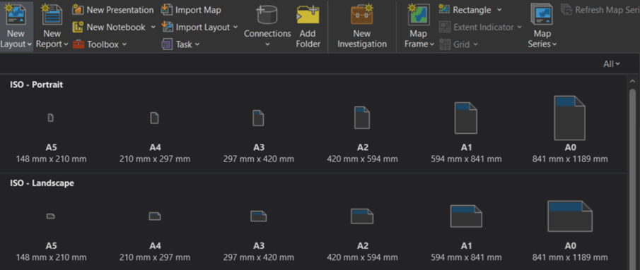

# Layout

1.  Na záložce *Insert* vybereme *New Layout* a zvolíme požadovaný formát

    <figure markdown>
      
    </figure>

2.  Ještě před umístěním obsahu je vhodné si v layoutu narýsovat pomocné vodící linky *(guides)* – pravým klikem v oblasti pravítka vybereme *Add Multiple Guides*, např. ohraničit okraje layoutu 5–10 mm (některé tiskárny nemusí podporovat bezokrajový tisk) a připravit si design layoutu (horizontálně oddělit prostor pro nadpis, mapový rám apod.)
    <figure markdown>
    
    </figure>

3.  Kompoziční prvky – každý prvek layoutu najdete v levém panelu obsahu (Table of Contents), odkud lze pravým klikem otevřít vlastnosti daného prvku. Zde měníme nastavení barev, fontů a další specifika různá dílčím druhů grafických elementů.
    1.	**severka**
        -   nezbytná zejména v případě, pokud projekce není orientovaná přímo na sever
        -   v české mapě nelze použít označení severu „N“
    2.  **tiráž**
        -   zdroje dat
        -   jméno autora
        -   afiliace, rok výroby
    3.  **legenda**
        -   název legendy (rozhodně není "legenda")
        -   popisky v legendě
            -   správné použití oddělovačů desetinných míst
            -   [pomlčka](https://prirucka.ujc.cas.cz/?id=165) není [spojovník](https://prirucka.ujc.cas.cz/?id=164)
            -   znak pro procenta: významový rozdíl 100% vs. 100 %
            -   v české mapě používáme české délkové jednotky
            -   pro zkratky jednotek užíváme malá písmena
            -   jednotky uvádíme do [hranatých závorek]

        ???+ note "&nbsp;Convert to Graphics"
            Pokud ke kýženému výsledku nevede jedno z defaultních nastavení legendy (či dodatečné přenastavení vizuálu ve vlastnostech legendy), využijeme převodu na grafiku (pravým klikem na legendu a *Convert to Graphics*) – poté je umožněno pracovat s každým prvkem zvlášť (textová pole, znaky), každopádně legenda poté již není dynamická a nereflektuje změny nastavení symbologie apod. (proto konvertujeme do grafiky až na závěr celého zpracování). Jednotlivé prvky je možné později opět spojit (označit více prvků s přidržením klávesy Shift a pravým klikem – *Group*). V případě převodu na grafiku legendy kartodiagramu nelze jakkoliv upravovat velikost symbolů, legenda by pak nebyla platná!
    
    4.  **měřítko**
        -   grafické či číselné
        -   v české mapě používáme české délkové jednotky
        -   pro zkratky jednotek užíváme malá písmena
        -   upravit segmenty grafického měřítka lze v jeho vlastnostech (není nutné přílišné dělení, ideální je popisovat dekadické hodnoty)

4.  Tisk layoutu
    -   Formát PDF
    -   300 DPI